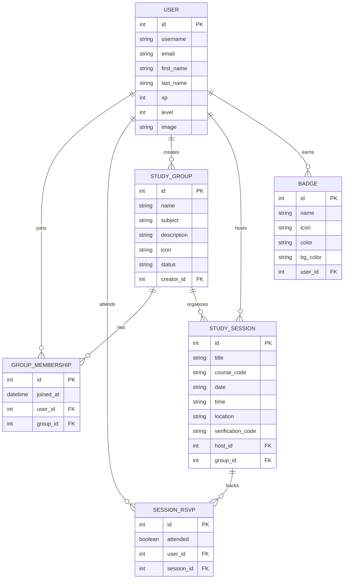

# 🎓 StudySphere

**StudySphere** is a premium, state-of-the-art student collaboration platform designed to make studying social, interactive, and gamified. Users can create study groups, schedule study sessions, share learning resources, chat in real-time, and earn XP and badges as they progress.

Built for the students of BMSCE, StudySphere elevates education by bringing modern, interactive, and highly responsive web design to the academic experience.

---

## 🚀 Modern Features & Implementations

*   **Gamified Learning & Leaderboards:** Dynamic user profiles with leveling (XP system) and earned badges. Live global leaderboard showcasing top students with unique, auto-generated DiceBear avatars.
*   **Next.js App Router Architecture:** Fully leverages Next.js 15+ App Router for seamless navigation, nested layouts, optimized loading states, and advanced routing patterns.
*   **Study Groups:** Collaborate on academic subjects with a built-in admin approval moderation workflow. Groups feature distinct icons and detailed membership tracking.
*   **Interactive Study Sessions:** Create and join study sessions with robust scheduling, location tagging, real-time RSVPs, and attendance verification.
*   **Modern Premium Visuals:** Next-generation UI utilizing Tailwind CSS v4, custom glassmorphism, responsive data grids, smooth micro-interactions, dark/light mode toggle, and Lucide React iconography.
*   **Production Ready Deployment:** Optimized for Vercel (Frontend) and Render/Supabase (Backend database hosting).

---

## 🏗️ App Architecture & ER Diagram

The platform utilizes a decoupled architecture where a React-based Next.js client consumes a RESTful API provided by a Python Django server.

### Entity Relationship (ER) Diagram



---

## 🛠️ Technology Stack

| Layer | Technology | Description |
| :--- | :--- | :--- |
| **Frontend Framework** | Next.js (App Router) | High-performance React framework with SSR and static generation |
| **Styling & UI** | Tailwind CSS v4, Radix UI | Modern utility-first styling and accessible UI primitives |
| **Backend API** | Django 4.2, DRF | Robust Python-based REST endpoints and business logic |
| **Authentication** | Simple JWT | Secure, stateless authentication token management |
| **Database** | Supabase (PostgreSQL) | Scalable production database with seamless Django integration |
| **Deployment** | Vercel & Render | Automated, highly-available CI/CD pipelines |

---

## 📂 Project Structure

```
studysphere/
├── app/                  # Next.js App Router (pages, layouts, globals)
│   ├── (auth)/           # Authentication routes
│   ├── dashboard/        # Authenticated student dashboard
│   ├── discover/         # Explore study sessions
│   └── leaderboard/      # Global gamified rankings
├── components/           # Reusable UI components (buttons, dialogs, cards, layouts)
├── lib/                  # Application library (API Axios clients, context providers)
├── backend/              # Django Python project directory
│   ├── api/              # Core API app (models, views, serializers, seed scripts)
│   ├── authentication/   # Custom Auth controller overrides
│   └── studysphere/      # Main Django project settings & URL routes
└── package.json          # Frontend dependencies and scripts
```

---

## 💻 Getting Started (Frontend)

### Prerequisites
*   **Node.js** (v20+ recommended)
*   **npm** or **pnpm**

### Installation & Run

1.  **Install dependencies** using legacy peer-deps to resolve strict React package matching:
    ```bash
    npm install --legacy-peer-deps
    ```

2.  **Start the local development server**:
    ```bash
    npm run dev
    ```

3.  Open [http://localhost:3000](http://localhost:3000) to view the client.

---

## 🐍 Getting Started (Backend)

### Prerequisites
*   **Python 3.12+**
*   **pip**

### Setup Environment

1.  **Navigate into the backend directory and create a virtual environment**:
    ```bash
    cd backend
    python -m venv venv
    ```

2.  **Activate the virtual environment**:
    *   **Windows**: `.\venv\Scripts\activate`
    *   **macOS / Linux**: `source venv/bin/activate`

3.  **Install requirements**:
    ```bash
    pip install -r requirements.txt
    ```

4.  **Create your local environment file**:
    Create a `.env` file (copied from `.env.example`) and edit accordingly:
    ```env
    DATABASE_URL=postgres://your-supabase-db-url
    SECRET_KEY=your-super-secret-key-here
    DEBUG=True
    ALLOWED_HOSTS=localhost,127.0.0.1,.onrender.com
    CORS_ALLOWED_ORIGINS=http://localhost:3000,https://your-vercel-app.vercel.app
    ```

5.  **Run database migrations**:
    ```bash
    python manage.py migrate
    ```

6.  **Seed robust sample data** (users, study groups, sessions, badges):
    ```bash
    python manage.py seed
    ```

7.  **Start the Django REST server**:
    ```bash
    python manage.py runserver
    ```
    The server will listen at [http://localhost:8000](http://localhost:8000).

---

## 📊 XP & Leveling Engine

XP points are awarded dynamically based on student participation:

| Action | XP Earned |
| :--- | :--- |
| **Create a Study Session** | `+50 XP` |
| **Join a Study Group** | `+25 XP` |
| **RSVP to a Session** | `+10 XP` |
| **Mark Verified Attendance** | `+100 XP` |

### Level Bounds
*   **Level 1:** `0 – 499 XP`
*   **Level 2:** `500 – 999 XP`
*   **Level 3:** `1000 – 1499 XP`
*   **Level 4:** `1500 – 1999 XP`
*   **Level 5+:** `2000+ XP` (Increments by 1 level for every additional 1000 XP)

---

## 🤝 Contributors

Built with ❤️ by:
*   [Talibuilds](https://github.com/talibuilds)
*   [Razancodes](https://github.com/razancodes)
*   [Mayankmehta](https://github.com/maayaankmehta)

---

## 📄 License

This project is licensed under the MIT License.
